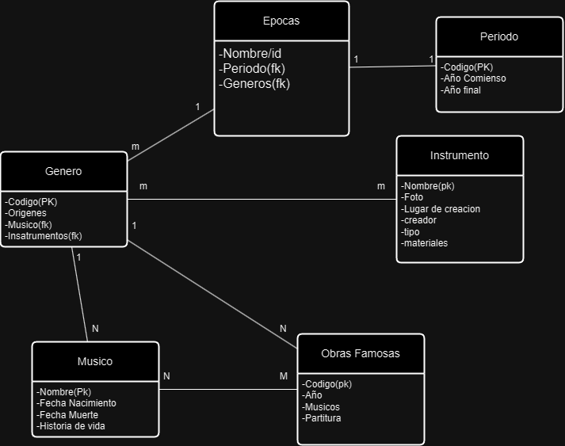
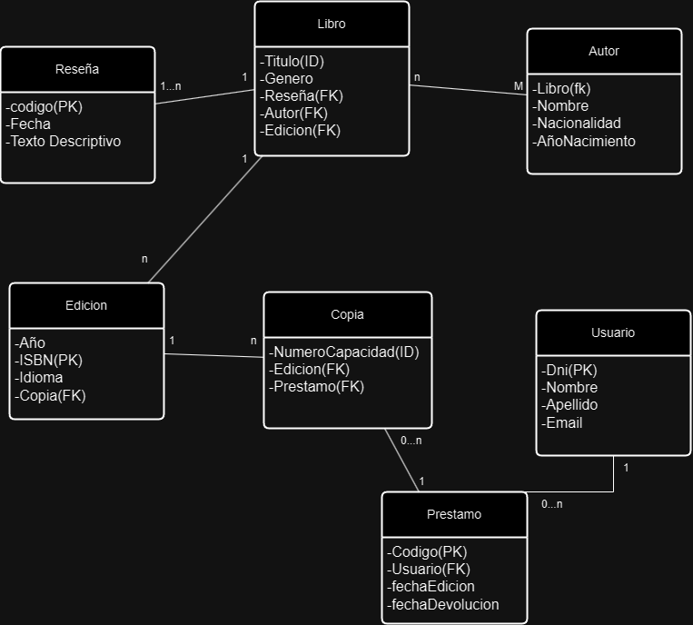
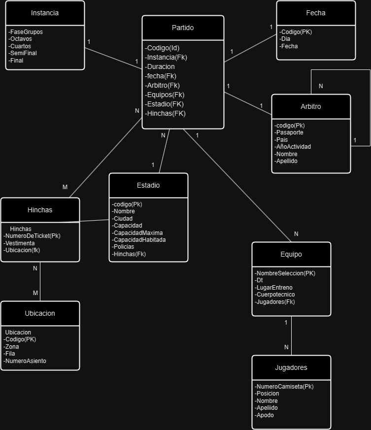

### Trabajo Practico N.2

### Epocas
- Nombre/id
- Periodo(fk)
- Generos(fk)

### Periodo
- Codigo(PK)
- Año Comienso
- Año final

### Genero
- Codigo(PK)
- Origenes
- Musico(fk)
- Insatrumentos(fk)

### Musico
- Nombre(Pk)
- Fecha Nacimiento
- Fecha Muerte
- Historia de vida

### Instrumento
- Nombre(pk)
- Foto
- Lugar de creacion
- creador
- tipo
- materiales
### Obras Famosas
- Codigo(pk)
- Año
- Musicos
- Partitura

[Excel.Epocas](Excels/)

### 2) Libro
- Titulo(ID)
- Genero
- Reseña(FK)
- Autor(FK)
- Edicion(FK)
### Reseña
- codigo(PK)
- Fecha
- Texto Descriptivo
### Autor
- Libro(fk)
- Nombre
- Nacionalidad
- AñoNacimiento
### Edicion
- Año
- ISBN(PK)
- Idioma
- Copia(FK)
### Copia
- NumeroCapacidad(ID)
- Edicion(FK)
- Prestamo(FK)
### Prestamo
- Codigo(PK)
- Usuario(FK)
- fechaEdicion
- fechaDevolucion
### Usuario
- Dni(PK)
- Nombre
- Apellido
- Email

[Excel.Biblioteca](Excels/tp2.2-Biblioteca.xlsx)

### 3) Partido
- Codigo(Id)
- Instancia(Fk)
- Duracion
- fecha(Fk)
- Arbitro(Fk)
- Equipos(Fk)
- Estadio(FK)
- Hinchas(FK)

### Fecha
- Codigo(PK)
- Dia
- Fecha
### Instancia
- FaseGrupos
- Octavos
- Cuartos
- SemiFinal
- Final
### Arbitro
- codigo(Pk)
- Pasaporte
- Pais
- AñoActividad
- Nombre
- Apellido
### Equipo
- NombreSeleccion(PK)
- Dt
- LugarEntreno
- Cuerpotecnico
- Jugadores(Fk)
### Jugadores
- NumeroCamiseta(Pk)
- Posicion
- Nombre
- Apeliido
- Apodo
### Estadio
- codigo(Pk)
- Nombre
- Ciudad
- Capacidad
- CapacidadMaxima
- CapacidadHabitada
- Policias
- Hinchas(Fk)
### Hinchas
- NumeroDeTicket(Pk)
- Vestimenta
- Ubicacion(fk)
### Ubicacion
- Codigo(PK)
- Zona
- Fila
- NumeroAsiento

[Excel.Qatar](Excels/tp2.3-Qatar22.xlsx)